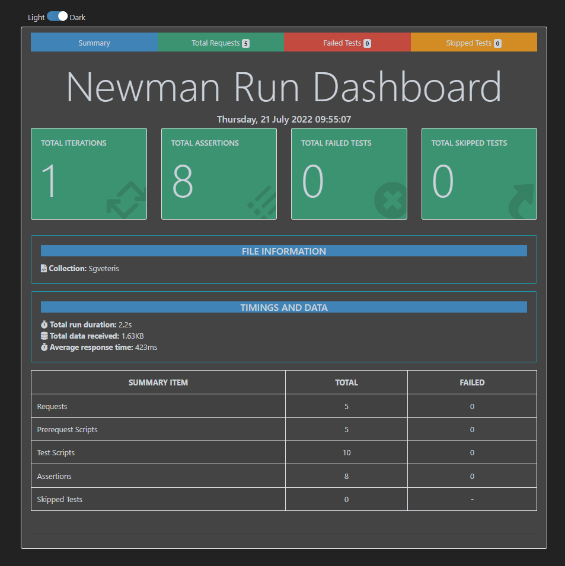

# SgVeteris Postman
_https://www.getpostman.com/collections/0a8518c4dff0341b2c23_


# CI/CD
I connected this postman API test with github actions thus it can be triggered when it got any pull request or push and programmatically by github APIs or manually via github.
https://github.com/dogukanberat/SgVeteris/runs/7444526576?check_suite_focus=true

# NewMan Results
 

## API Test Scenarios

1-
- Merchant should be able to authorize and get token with login credentials

  _Expectation: Merchant should be received correct token code_


```http
  POST /auth/token
```


**REQUEST OBJECT**

| Parameter        | Value         | 
|:----------------|:--------------|
| `merchant_code` | `20720085303` | 
| `password`      | `f3bf10e5-ce97-4364-bf9e-1606bf450465`       |

`Send post request with this parameters and get response token and set next requests header
`


---
2-
- Merchant tries to login with invalid credentials

  _Expectation: Merchant should be received an error message_

```http
  POST /auth/token
```
**REQUEST OBJECT**

| Parameter        | Value         | 
|:----------------|:--------------|
| `merchant_code` | `20720085303` | 
| `password`      | `test1`       |

`Send post request with this wrong parameters
`


---
3-
- Merchants can receive BTC buy rate using correct token

  _Expectation: Merchant should be received the rate._

```http
  GET /buy/prices/BTC
```
`Send GET request to api /buy/prices/BTC with Auth Token
`


---
4-
- Merchant calls incorrect cryptocurrency code "etc" using correct token
  _Expectation: Merchant should be received an unsupported cryptocurrency message_


```http
  GET /buy/prices/etc
```
`  Send GET request to api /buy/prices/etc with Auth Token
`


---
5-
- Merchant can create a btc address using Create Deposit Address endpoint.
  _Expectation: Merchant should be received a BTC address_


```http
  POST /customer/deposit/address
```


**REQUEST OBJECT**

| Parameter        | Value            | 
|:----------------|:-----------------|
| `cryptocurrency` | `btc`            | 
| `customer`      | `CUSTOMEROBJECT` |


**CUSTOMER OBJECT**

| Parameter        | Value            | 
|:----------------|:-----------------|
| `reference_id` | `20720085303`            | 
| `first_name`      | `Dogukan` |
| `last_name`      | `Elbasan` |
| `email`      | `dogukanelbasan0@gmail.com` |


`  Send post request to api /customer/deposit/address with Auth and Correct Data`

---
